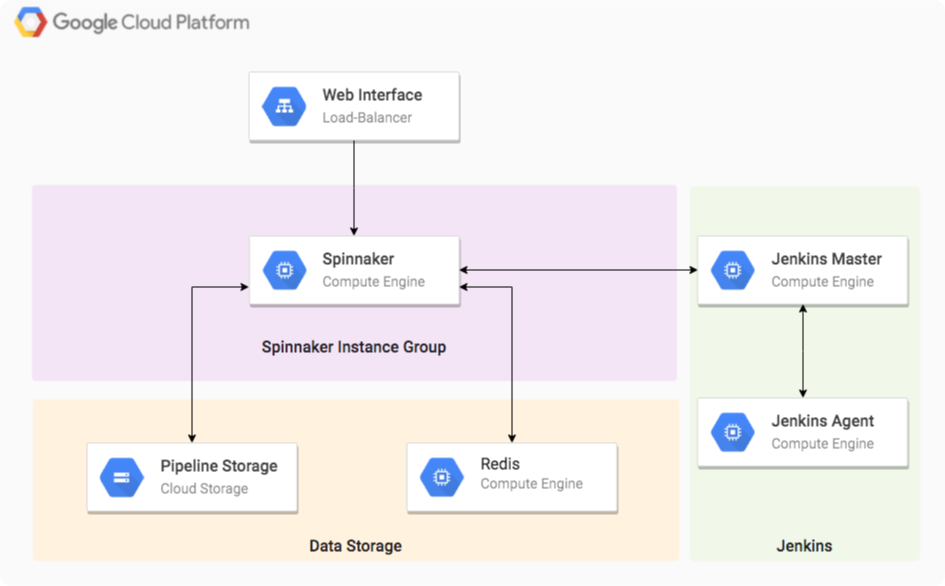

# Deployment Manager Templates for Spinnaker

This repository contains Deployment Manager template for deploying [Spinnaker](http://www.spinnaker.io/).
By default, this will deploy the following topology:

Spinnaker will store its state in Google Cloud Storage and Redis. Jenkins
is used to run scripts required during the build process or in order to trigger
a pipeline.

## Deploying

1. Download the repository.
1. Create the deployment:

       gcloud deployment-manager deployments create --config config.yaml [DEPLOYMENT_NAME] --properties jenkinsPassword=[YOUR_PASSWORD]
1. Once instance provisioning is complete get the name of your Spinnaker instance by
   running:

       gcloud compute instances list | grep spinnaker
1. Creating an SSH tunnel to your Spinnaker instance as follows:

       gcloud compute ssh [DEPLOYMENT_NAME]-spinnaker-ogo8 --zone us-west1-a -- -L 9000:localhost:9000 -L8084:localhost:8084

1. Access the UI by visiting the following web address:

       http://localhost:9000

## Teardown

1. Delete the deployment by running:

       gcloud deployment-manager deployments delete [DEPLOYMENT_NAME]
